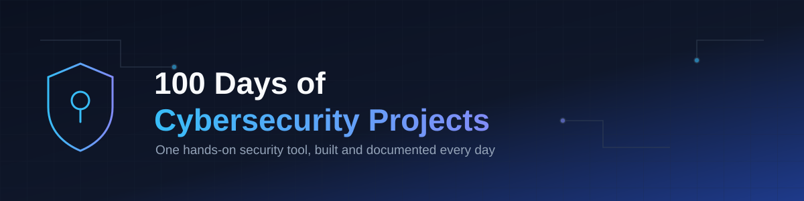

  
 

  
  
  
  

  
  

  

---

## About This Repo

This is my 100 Days of Building Cybersecurity Projects challenge — one project at a time, every day, building real security tools from the ground up. No filler, no theory-only content: everything here is something I actually built, broke, fixed, and learned from along the way. Follow along as I go from foundational scripts to more advanced security engineering work.

**Progress:** Day 1 / 100

---

## Progress Tracker

| Day | Project | Language | Date | Status |
|-----|---------|----------|------|--------|
| 001 | | | | 🚧 In Progress |
| 002 | | | | ⬜ Not Started |
| 003 | | | | ⬜ Not Started |
| 004 | | | | ⬜ Not Started |
| 005 | | | | ⬜ Not Started |

